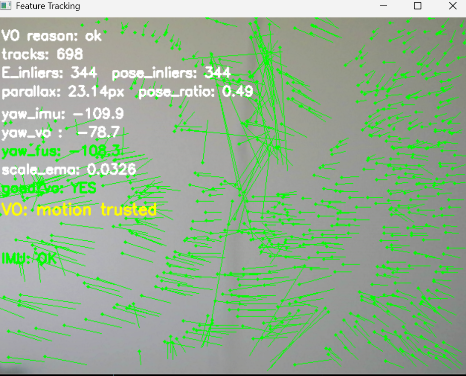
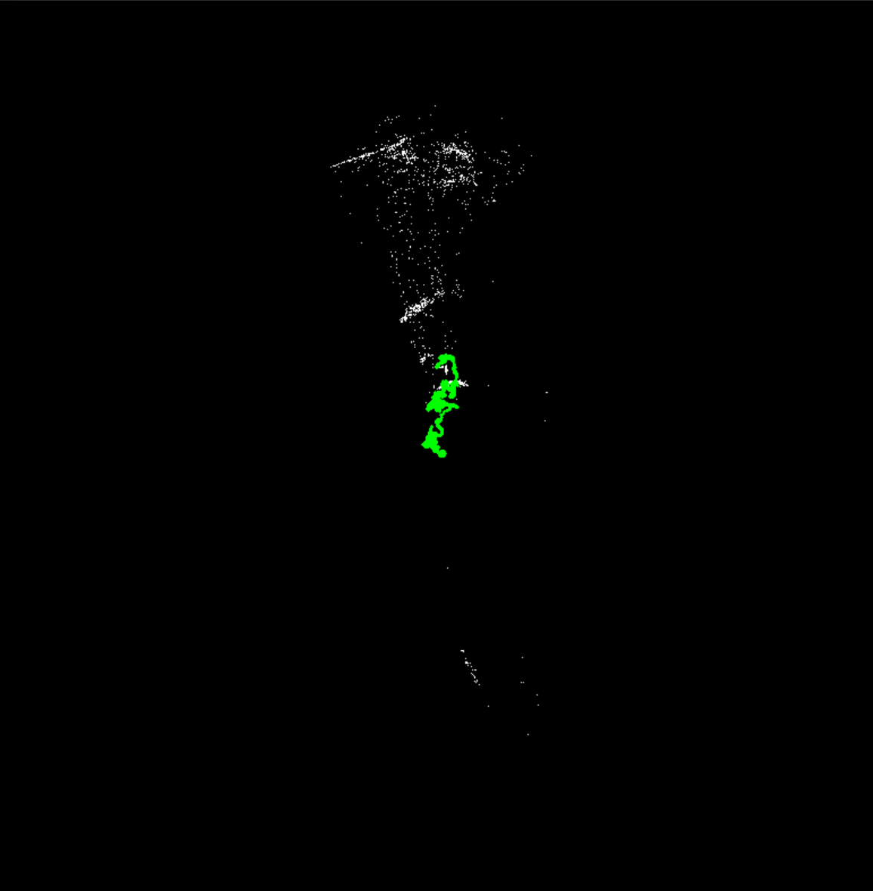

# Handheld Visual-Inertial SLAM Prototype

A real-time handheld SLAM-style system built using a USB webcam and ESP32 IMU, combining computer vision and sensor fusion to estimate motion and reconstruct a sparse 3D map.

This project implements a full pipeline including feature tracking, monocular visual odometry, IMU-based orientation estimation, vision-IMU yaw fusion, triangulation, and real-time visualization.

---

## Features

### Feature Tracking
- Shi–Tomasi corner detection (`goodFeaturesToTrack`)
- Lucas–Kanade optical flow (`calcOpticalFlowPyrLK`)
- Forward-backward consistency filtering

### Visual Odometry
- Essential matrix estimation (MAGSAC)
- Robust inlier filtering
- Relative pose recovery (`recoverPose`)

### IMU Integration
- Gyroscope-based orientation propagation
- Accelerometer gravity correction
- Complementary filter for roll/pitch stability

### Sensor Fusion
- Vision-based yaw combined with IMU roll/pitch
- Smooth yaw blending

### 3D Mapping
- Triangulation of feature correspondences
- Cheirality filtering (points in front of camera)
- Reprojection error filtering
- Sparse map accumulation
- Voxel-based downsampling for cleaner structure

### Visualization
- Real-time feature tracking overlay
- Trajectory visualization
- Top-down map viewer
- Debug overlays for parallax, inliers, yaw, and scale

---

## System Overview

Pipeline:
```
Camera → Feature Tracking → Visual Odometry → Pose Estimation
↓
IMU → Attitude Filter → Yaw Fusion → Fused Pose
↓
Triangulation + Mapping
↓
Visualization (Trajectory + Map)
```
---

## Hardware

- USB Webcam (640×480)
- ESP32 Development Board
- ICM-20948 IMU
- PC (Windows)

---

## Installation

Clone the repository:
git clone https://github.com/yourusername/handheld-visual-inertial-slam.git
cd handheld-visual-inertial-slam

Install dependencies:
pip install -r requirements.txt


---

## Camera Calibration

Accurate calibration significantly improves inlier detection, triangulation quality, and map stability.

### Step 1: Obtain a Checkerboard

Generate a checkerboard pattern:

https://calib.io/pages/camera-calibration-pattern-generator

Recommended settings:
- Pattern: Checkerboard
- Squares: 9 x 6
- Square size: any (e.g., 25 mm)

Important:
- OpenCV uses inner corners
- A 9×6 squares board corresponds to:
  Checker = (8x5)

---

### Step 2: Run Calibration
python calibrate_camera.py


Instructions:
- Hold the checkerboard in front of the camera
- Press SPACE when corners are detected
- Capture approximately 15–25 images from different angles
- Press ESC when finished

---

### Step 3: Output

The script generates:
camera_calib.npz
  

Containing:
- Camera matrix (K)
- Distortion coefficients

---

### Step 4: Automatic Integration

`main.py` loads calibration automatically:

```python
cal = np.load("camera_calib.npz")
K = cal["K"]
dist = cal["dist"]
Frames are undistorted before processing:
frame = cv2.undistort(frame, K, dist)
```
## Running the System
python main.py


Ensure:
- ESP32 IMU is connected and streaming data
- Correct serial port is configured
- Camera is accessible

---

## Testing Procedure

### Stationary
- Expected behavior:
  - Low parallax
  - VO rejected (`good_vo = NO`)
  - Stable trajectory

### Rotation in Place
- Expected behavior:
  - Yaw updates
  - Minimal translation

### Sideways Motion
- Move camera left/right
- Expected behavior:
  - High parallax
  - High inlier count
  - Smooth trajectory updates

### Motion Around Objects
- Expected behavior:
  - Map grows
  - Structure becomes visible

---

## Debug Overlay

| Metric | Description |
|--------|------------|
| tracks | Number of tracked features |
| E_inliers | Inliers from Essential matrix estimation |
| pose_inliers | Valid points after pose recovery |
| parallax_px | Pixel displacement between frames |
| pose_ratio | Inlier ratio |
| yaw_imu | IMU-derived yaw |
| yaw_vo | Vision-derived yaw |
| yaw_fus | Fused yaw |
| scale_ema | Smoothed translation scale |
| good_vo | Whether frame is considered reliable |

---
## Demo

### Feature Tracking


### Trajectory and Map


<p align="center">
  
  
</p>

## Limitations

- Monocular scale is not metric
- Drift accumulates over time (no loop closure)
- Performance degrades in low-texture or planar environments
- Requires sufficient parallax for stable estimation

---

## Future Work

- Keyframe-based optimization
- PnP-based pose refinement
- Loop closure detection
- Full visual-inertial state estimation (EKF or factor graph)
- Quaternion-based orientation tracking
- GPU acceleration

---

## Documentation

Full project notes, derivations, and implementation details are available here:

https://drive.google.com/file/d/1FgOXPNJwSpBoMadO8InK9irI_AYSWOiQ/view?usp=sharing

---

## License

MIT License

---

## Author

Mason Buffum  
Electrical and Computer Engineering, University of Colorado Boulder  
Focus areas: AI, robotics, embedded systems
